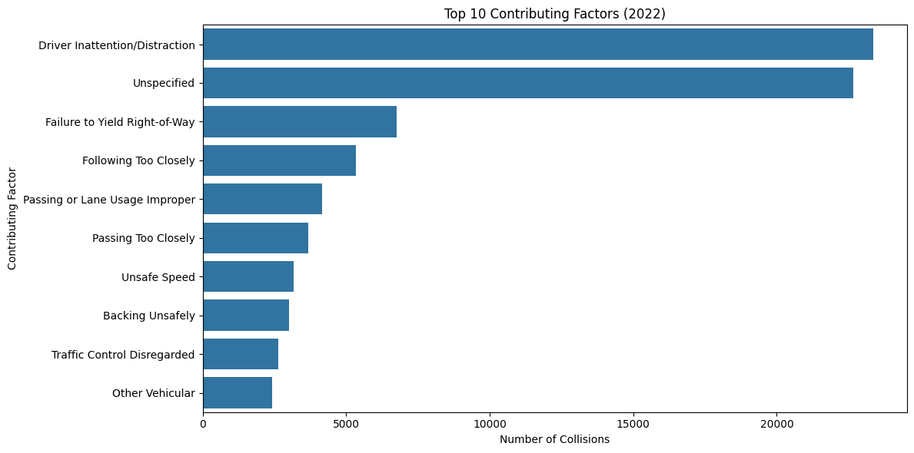
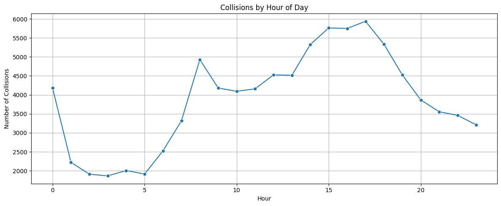
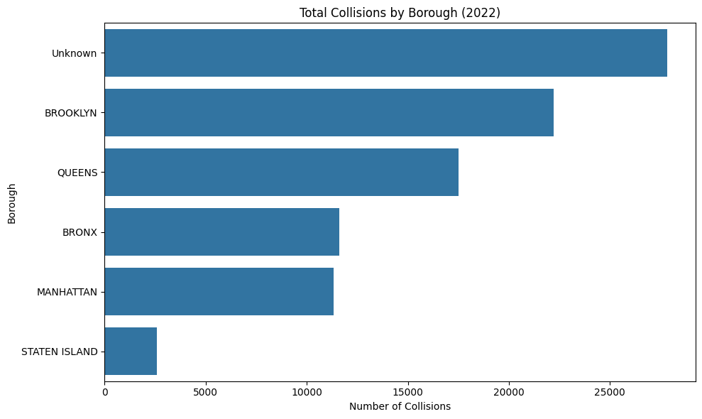
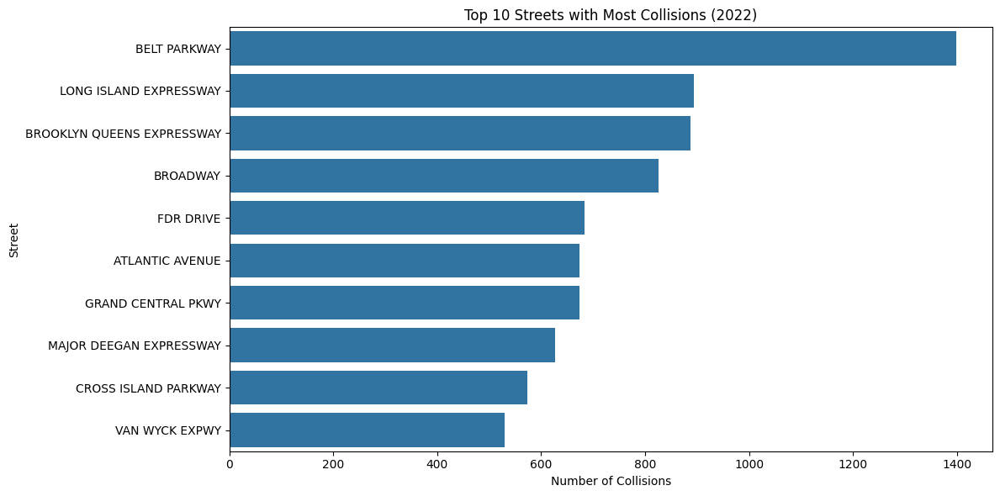

# nyc-collision-insights-2022
# 🚦 NYC Traffic Collisions Analysis (2022)

This project explores traffic collision data in New York City using Google BigQuery and visualizes key insights with Python in Google Colab. The aim is to identify high-risk factors, time patterns, and geographic hotspots for accidents using publicly available data.

---

## 📌 Project Highlights

- ✅ Queried over 100,000 collision records from BigQuery (2022 data)
- ✅ Cleaned and transformed data using Pandas
- ✅ Created impactful visualizations with Seaborn, Matplotlib, and Folium
- ✅ Built an interactive NYC map with clickable accident markers
- ✅ Exported and structured the project for sharing on GitHub

---

## 📊 Key Visualizations

- 🔹 **Top 10 Contributing Factors** to traffic accidents
- 🔹 **Collisions by Hour of Day**
- 🔹 **Accidents by Borough**
- 🔹 **Most Dangerous Streets**
- 🔹 **Interactive Map** of NYC accidents with detailed popups

  
  
  
  

---
## 🗺️ Interactive Map
 NYC Traffic Collision Maps – 2022 (15,000 Sampled Records)

To offer a detailed yet performant view of NYC’s traffic crash patterns, these maps were built using 15,000 sampled records from the 2022 dataset.

---

#### 1️⃣ Collision Marker Map (15K)

Clustered map showing 15,000 sampled collisions. Viewers can click clusters to explore individual crash details by borough, street, and contributing factor.

---

## 🛠️ Tools Used

| Tool           | Purpose                                  |
|----------------|------------------------------------------|
| **BigQuery**   | Querying NYC collision dataset (SQL)     |
| **Google Colab** | Python environment for analysis         |
| **Pandas**     | Data cleaning and manipulation           |
| **Seaborn & Matplotlib** | Data visualizations            |
| **Folium**     | Interactive map with location clustering |
| **GitHub**     | Project documentation and portfolio      |

---

## 📂 Project Structure
Traffic-Collision-Analysis/
├── README.md
├── nyc_collision_analysis.ipynb
├── nyc_collisions_2022.csv
├── nyc_collisions_heatmap_clustered_full.html
├── images/
│   ├── nyc_heatmap_full_2022.png
│   ├── top_contributing_factors.png
│   ├── borough_collisions.png
│   └── collisions_by_hour.png

## 📎 Dataset Source

- **NYC Open Data - Motor Vehicle Collisions**  
  Dataset used from BigQuery:  
  `bigquery-public-data.new_york_mv_collisions.nypd_mv_collisions`

---

## 👨‍💻 Author

**Ravi Varma Pakalapati**  
📧 pakalapatiravivarma.99@gmail.com
🌐 [LinkedIn](https://www.linkedin.com/in/ravi-varma-pakalapati/)

---

## 📢 License

This project is for educational and portfolio use. Data used is publicly available from NYC Open Data.

